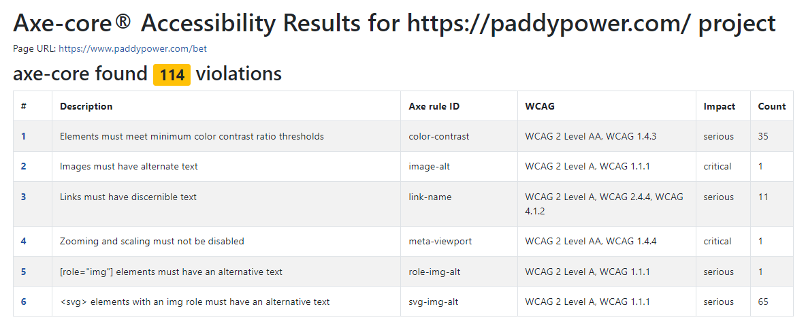
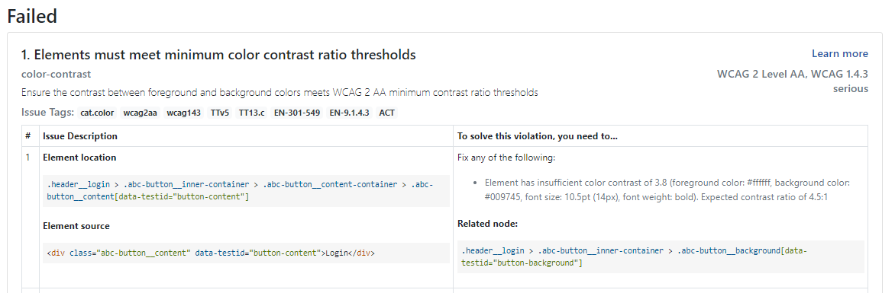

## Accessibility

### Example

This is an example of the accessibility scan, along with specific conformance tags to check against. The assertion is expecting no violations to be returned.

WCAG2A was released in 2008 and provides a basic level of accessibility requirements. WCAG21A was released in 2018 and is an extension of the original standard, providing additional guidelines.

```
const accessibilityScanResults = await new AxeBuilder({ page })`
.withTags(['wcag2a', 'wcag2aa', 'wcag21a', 'wcag21aa'])
.analyze();

expect(accessibilityScanResults.violations).toEqual([]);
```

There are three levels of conformance:

- Level A is the minimum level.
- Level AA includes all Level A and AA requirements. Many organizations strive to meet Level AA.
- Level AAA includes all Level A, AA, and AAA requirements.

### Dependencies

- axe-core/playwright
- axe-html-reporter

### Analysis

This is the main overview of all Accessiblity violations.



There is also a breakdown of individual violations, along with solution examples.




